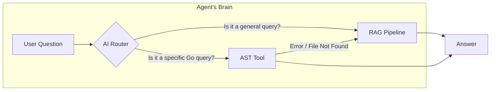

# Feature Deep Dive: Retrieval-Augmented Generation (RAG)

This document explains the implementation of the Retrieval-Augmented Generation (RAG) system, which forms the backbone of the agent's ability to answer general, open-ended questions about the codebase.

### Presentation Flow: The RAG Lifecycle

The RAG process is divided into two main phases: Indexing (done once) and Querying (done for each question).

```mermaid
flowchart TD
    subgraph "Phase 1: Indexing (One-Time Setup)"
        A[Start Agent] --> B[Walk Codebase Files];
        B --> C[Read & Chunk Files];
        C --> D[Generate Embedding for Each Chunk];
        D --> E[Store Chunks & Embeddings in Vector Store];
        E --> F[Cache Vector Store for Future Use];
    end

    subgraph "Phase 2: Querying (Per Question)"
        G[User Asks General Question] --> H{Agent Router};
        H -- "Chooses 'vector_search'" --> I[Generate Embedding for Question];
        I --> J[Search Vector Store for Similar Chunks];
        J --> K[Retrieve Top-K Matching Chunks];
        K --> L[Build Context from Chunks];
        L --> M[Prompt LLM with Context + Question];
        M --> N[Receive Final Answer];
    end
```

### What It Is
Retrieval-Augmented Generation (RAG) is a technique that enhances the knowledge of a Large Language Model (LLM) with information retrieved from an external source. In Gollora, the "external source" is the codebase itself.

Instead of asking the LLM a question about a repository it has never seen, we first find the most relevant snippets of code from the repository and provide them to the LLM as context along with the question. This grounds the model's answer in the actual source code, dramatically reducing hallucinations and improving accuracy for general queries.

### How It's Implemented

The entire RAG pipeline is implemented within `internal/agent/agent.go`.

#### 1. Indexing: Building the Knowledge Base
When the Q&A agent is first initialized via `NewAgent`, it builds its knowledge base.

-   **File Traversal:** The `index` method walks the entire repository path. It uses a helper, `isTextFile`, to ignore binary files and the `.git` directory.
-   **Chunking:** Each valid text file is read and split into small, overlapping text chunks using the `splitIntoChunks` function. This ensures that semantic context isn't lost at chunk boundaries.
-   **Embedding:** For each chunk, an API call is made to Google's `text-embedding-004` model via `aiClient.GenerateEmbeddings`. This converts the text chunk into a vector (a list of numbers) that represents its semantic meaning.
-   **Vector Store:** Each `Chunk` object, containing its content, file path, and vector embedding, is stored in the `agent.vectorStore` slice. This in-memory slice acts as our vector database.
-   **Caching:** After indexing, the entire vector store and a hash of the repository state are saved to a cache file in `~/.gollora/cache/`. On subsequent runs, if the repository hasn't changed, the agent loads directly from this cache, skipping the time-consuming indexing process.

#### 2. Retrieval: Finding Relevant Context
When a user asks a question that the router directs to RAG, the `answerWithRAG` function is called.

-   **Question Embedding:** First, the user's question is also converted into a vector embedding.
-   **Similarity Search:** The `retrieveChunks` function iterates through every chunk in the `vectorStore` and calculates the **cosine similarity** between the question's embedding and the chunk's embedding. This score represents how semantically related they are.
-   **Top-K Selection:** The chunks are sorted by their similarity score, and the top `k` (e.g., top 5) most relevant chunks are selected.

#### 3. Augmentation & Generation: Answering the Question
-   **Context Building:** The content of these top-k retrieved chunks is concatenated into a single block of text, prefixed with comments indicating their source file (e.g., `--- From file: cmd/main.go ---`).
-   **Prompting:** A final prompt is constructed that includes the retrieved context and the original user question. It instructs the LLM to answer the question based *only* on the provided context.
-   **Final Answer:** This prompt is sent to the Gemini API via `aiClient.GenerateContent`, and the resulting text is returned to the user as the final answer.

### Interaction with Other Features

RAG does not operate in isolation; it's a key part of the broader agentic system.

-   **The Agentic Router:** RAG is the default tool. The `routeToTool` function in `agent.go` makes a specific choice: if a question is highly specific and fits the pattern of the `ast_tool` (e.g., "find handlers in file X"), it bypasses RAG. For everything else (e.g., "how does authentication work?"), it chooses RAG (`vector_search`).
-   **Graceful Fallback:** The system is robust. As seen in `answerWithAST`, if the AST tool is chosen but fails (e.g., the user specifies a file that doesn't exist), the agent automatically falls back to the `answerWithRAG` method to still attempt a useful answer.

### Use Cases & Examples

#### Use Case 1: Understanding a Component's Purpose (Ideal for RAG)
A developer wants to understand what a specific part of the system does.

-   **Question:** `What is the purpose of the ResultAggregator?`
-   **Execution Path:** The router sees this as a general question and chooses `vector_search`. The RAG pipeline finds relevant chunks from `cmd/aggregator.go`, including comments and function definitions. The LLM synthesizes this context to explain that the aggregator's job is to combine, deduplicate, and score issues from different analyzers.

#### Use Case 2: Finding Specific Code Structures (Handled by AST)
A developer needs to find exact structural information.

-   **Question:** `list the global variables in cmd/main.go`
-   **Execution Path:** The router identifies this as a specific query for the `ast_tool`. RAG is **not** used. The AST tool parses the file and returns a precise list, which the LLM then formats for the user. This is faster and more accurate than RAG for this type of query.