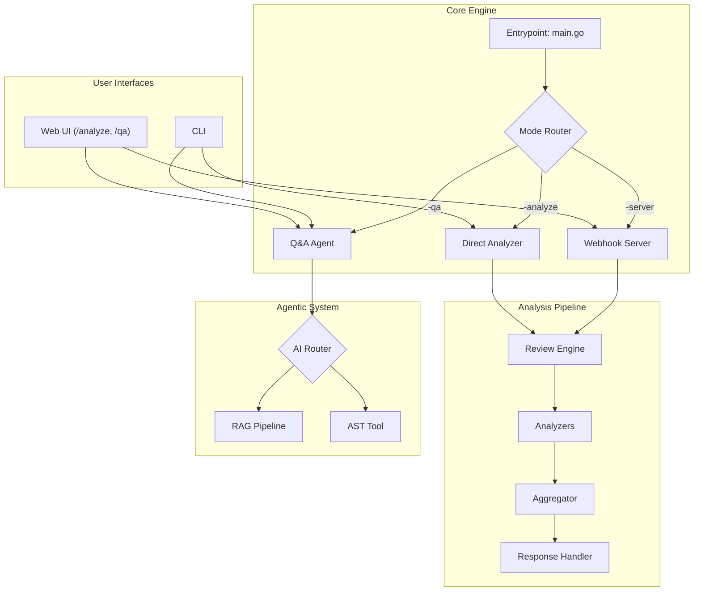

# 🚀 Gollora - Code Quality Intelligence Agent

Gollora is an AI-powered agent that analyzes code repositories to generate actionable, developer-friendly reports. It integrates with GitHub to provide real-time feedback on pull requests, combining traditional static analysis with advanced AI-powered insights to help developers improve code quality, security, and maintainability.

---

## ✨ Features

### Core Capabilities
- **Git Integration:** Seamlessly integrates with GitHub pull requests for automated reviews.
- **Multi-Language Static Analysis:** Uses industry-standard tools like `golangci-lint` for Go and `flake8` for Python.
- **Customizable Configuration:** Supports granular configurations for the server, analysis tools, and AI provider.
- **CI/CD Feedback Loop:** Posts clear, actionable comments directly to GitHub PRs.

### Advanced Features (Super Stretch)
- **Interactive Q&A Agent:** Ask natural language questions about your codebase via a web UI or CLI.
- **Retrieval-Augmented Generation (RAG):** Enables Q&A on large codebases by providing relevant code context to the LLM.
- **AST Parsing:** For high-precision structural code analysis on Go files, enabling queries like "find all HTTP handlers".
- **Agentic Tool-Use:** The Q&A agent intelligently routes questions to the best tool (RAG vs. AST) for accurate answers.
- **AI-Powered Severity Scoring:** Goes beyond static rules to assess issue severity based on code context.
- **On-Demand Analysis Dashboard:** A web UI to analyze any public repo and visualize results in real-time.
- **Developer-Friendly Visualizations:** A rich dashboard with charts for issue severity, language breakdown, and file "hotspots", plus auto-generated dependency graphs.

---

## 📊 System Architecture

Gollora uses a modular, event-driven architecture that enables flexible integration and powerful analysis capabilities.



---

## 📚 Documentation

Dive deeper into the project's design, features, and implementation.

- **[Architecture & Design Notes](architechture.md):** High-level design decisions and trade-offs.
- **[Project Requirements & Fulfillment](project_requirement.md):** How the project meets the assignment goals.
- **[Technical Notes](technincal_notes.md):** A list of all external tools, APIs, and libraries used.
- **Feature Deep Dives:**
    - **[Retrieval-Augmented Generation (RAG)](RAG.md):** How the agent answers general questions.
    - **[AST-Powered Q&A](feature_ast.md):** How the agent answers precise structural questions.
    - **[AI-Powered Severity Scoring](ai_scoring.md):** How issue priority is intelligently determined.
    - **[On-Demand Analysis Dashboard](dashboard.md):** How the web UI provides rich visualizations.

---

## 💻 Installation

### ✅ Prerequisites
- Go 1.22 or later
- Git
- An AI provider API key (e.g., Google Gemini)

### 🔧 Building from Source
```bash
# Clone the repository
git clone https://github.com/euclidstellar/gollora.git
cd gollora

# Build the application
go build -o gollora ./cmd
```

---

## ⚙️ Configuration

1.  **Copy the Environment File:**
    ```bash
    cp .env.example .env
    ```
2.  **Edit `.env`:** Open the `.env` file and add your secret keys. This file is ignored by Git.
    ```properties
    # .env
    GITHUB_WEBHOOK_SECRET="your_github_webhook_secret"
    GITHUB_API_TOKEN="your_github_personal_access_token"
    AI_API_KEY="your_gemini_api_key"
    ```
3.  **Review `config.yaml`:** The main configuration in `configs/config.yaml` controls the server, AI provider, and default settings. You can typically use the defaults.
4.  **Review `analysis_tools.yaml`:** The file at `configs/analysis_tools.yaml` defines which static analysis tools to run for each language.

---

## 📋 Usage

Gollora can be run in three primary modes.

### Mode 1: Web Application Server (Recommended)
This mode runs a web server that provides the On-Demand Analysis Dashboard, the Interactive Q&A agent, and listens for GitHub webhooks.

```bash
# Run the server
./gollora -server
```
- **On-Demand Analysis:** Open `http://localhost:8080/analyze`
- **Interactive Q&A:** Open `http://localhost:8080/qa`
- **Webhook Endpoint:** `http://localhost:8080/webhook/github`

### Mode 2: CLI Interactive Q&A
Chat with the Q&A agent directly from your terminal.

```bash
# Point the agent at a local repository path
./gollora -qa -repo-path /path/to/your/codebase
```

### Mode 3: CLI Direct Analysis
Run a one-off analysis on a local repository and export the results to files.

```bash
# Analyze the difference between two commits
./gollora -analyze -repo-path /path/to/repo -base-commit <base-sha> -head-commit <head-sha>
```

---

## 🔗 CI/CD Integration (via GitHub Webhook)

To get automated reviews on your pull requests, you need to connect a GitHub App to your running Gollora server.

1.  **Expose Your Local Server:** Use a tool like `ngrok` to create a public URL for your local server.
    ```bash
    # Install ngrok and authenticate, then run:
    ngrok http 8080
    ```
    Copy the `https://*.ngrok-free.app` URL.

2.  **Create a GitHub App:**
    - Go to your GitHub Settings > Developer settings > GitHub Apps > New GitHub App.
    - **Webhook URL:** Paste your ngrok URL, followed by `/webhook/github`.
    - **Webhook Secret:** Paste the secret from your `.env` file.
    - **Permissions:** Grant **Read & write** access for `Pull requests` and **Read-only** access for `Contents` and `Metadata`.
    - **Subscribe to events:** Check `Pull request`.

3.  **Install and Test:**
    - Install the app on a repository of your choice.
    - Create a new pull request in that repository.
    - Gollora will post a review as a PR comment.

---

## 📁 Project Structure

```plaintext
gollora/
│
├── cmd/                 # Main application and entry points
│   ├── main.go          # CLI router and main function
│   ├── webhook.go       # Webhook/web UI handlers
│   ├── review_engine.go # Analysis orchestration
│   └── ...
│
├── internal/
│   ├── agent/           # Q&A agent logic (RAG, routing)
│   ├── ai/              # AI provider client (Gemini)
│   ├── analyzers/       # Language-specific static analyzers
│   ├── models/          # Core data structures (Config, Result, etc.)
│   ├── tools/           # Specialized tools (e.g., AST parser)
│   └── utils/           # Helper functions (git, formatting)
│
├── web/                 # HTML/CSS/JS for the web UI
│   ├── analyze.html     # Analysis dashboard UI
│   └── qa.html          # Q&A chat UI
│
├── docs/                # Project documentation files (*.md)
│
├── configs/             # YAML configuration files
│
└── go.mod, go.sum       # Go module files
```
# golloraa
