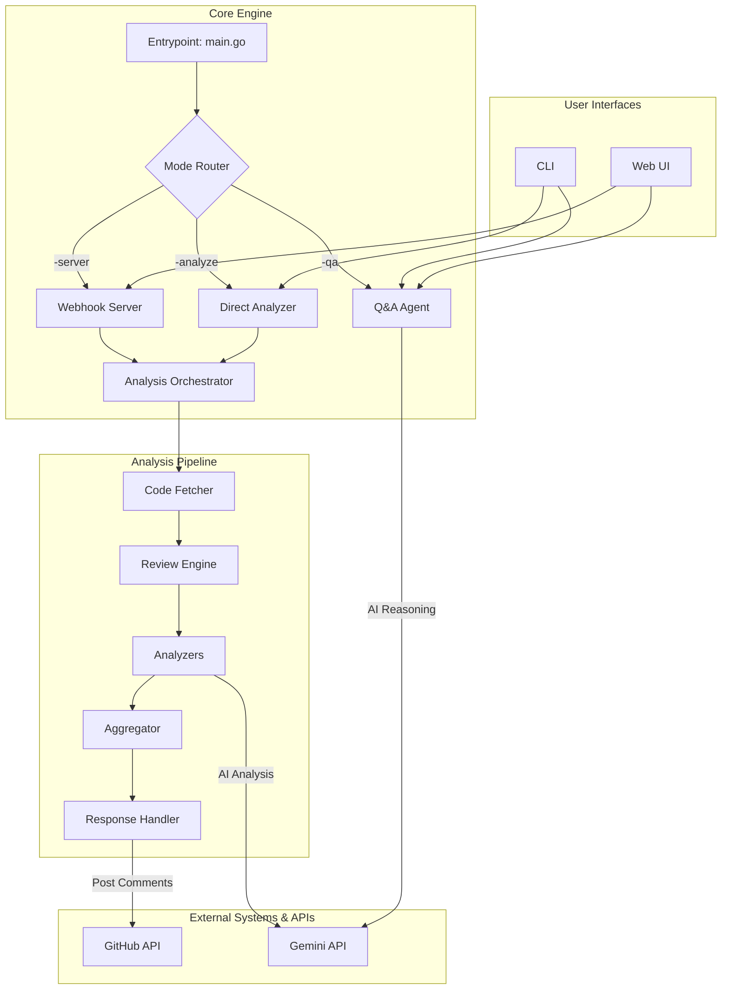

# Architecture & Design Notes

This document outlines the high-level architectural decisions, patterns, and trade-offs made during the development of the Gollora Code Quality Intelligence Agent.

## 1. High-Level Architecture

Gollora is designed as a modular, event-driven system. The core architecture separates concerns into distinct components, allowing for maintainability and extensibility.

## 2. Major Design Decisions & Trade-offs

### Decision: Agentic Design for Q&A
- **What:** Instead of a simple RAG pipeline, the Q&A feature was implemented using an agentic pattern. An AI-powered "router" first decides *how* to answer a question.
- **Why:** This allows the system to use the best tool for the job. For general questions, Retrieval-Augmented Generation (RAG) is effective. For precise structural queries about code, Abstract Syntax Tree (AST) parsing is far more accurate and reliable.
- **Trade-off:** This adds a layer of complexity and an extra LLM call for routing. However, the significant increase in accuracy for specific code-related questions justifies the overhead.

### Decision: Hybrid Analysis (Static + AI)
- **What:** The analysis engine combines traditional, fast static analysis tools (`golangci-lint`) with slower, more context-aware AI analysis (Gemini).
- **Why:** Static analyzers are excellent at catching a wide range of common, well-defined issues quickly. AI excels at identifying nuanced problems, understanding intent, and providing deeper insights that static tools might miss. This hybrid approach provides both breadth and depth.
- **Trade-off:** Running AI analysis on every file can be slow and costly. This was mitigated by using a `filterFilesForAI` function to select only the most critical or changed files for AI review, creating a balanced "best of both worlds" approach.

### Decision: Decoupled UI via WebSockets
- **What:** The web interfaces (`/qa` and `/analyze`) communicate with the backend via WebSockets instead of traditional HTTP request/response cycles.
- **Why:** Code analysis is a long-running process. WebSockets provide a persistent, bidirectional communication channel, allowing the backend to stream real-time status updates (`Cloning...`, `Indexing...`, `Analyzing file X...`) to the user. This creates a much better user experience than a silent, spinning loader.
- **Trade-off:** WebSocket management adds statefulness and complexity to the backend compared to stateless HTTP handlers. However, for an interactive, long-polling application like this, the UX benefits are immense.

### Decision: No Third-Party Agent Frameworks (Langchain, etc.)
- **What:** The agent and AI logic were built from scratch using standard Go libraries and direct calls to the Gemini API.
- **Why:**
    1.  **Transparency & Control:** Building directly provides full control over prompts, API calls, and data processing. This avoids the "black box" nature of some frameworks and makes debugging easier.
    2.  **Performance:** It avoids the overhead that can be associated with large, general-purpose frameworks.
    3.  **Learning & Depth:** It demonstrates a deeper understanding of the underlying mechanics of building AI agents, which was a key goal of the project.
- **Trade-off:** This required more boilerplate code for things like API request handling and JSON parsing, which frameworks often abstract away. The development time was likely longer, but the result is a more tailored and lightweight solution.