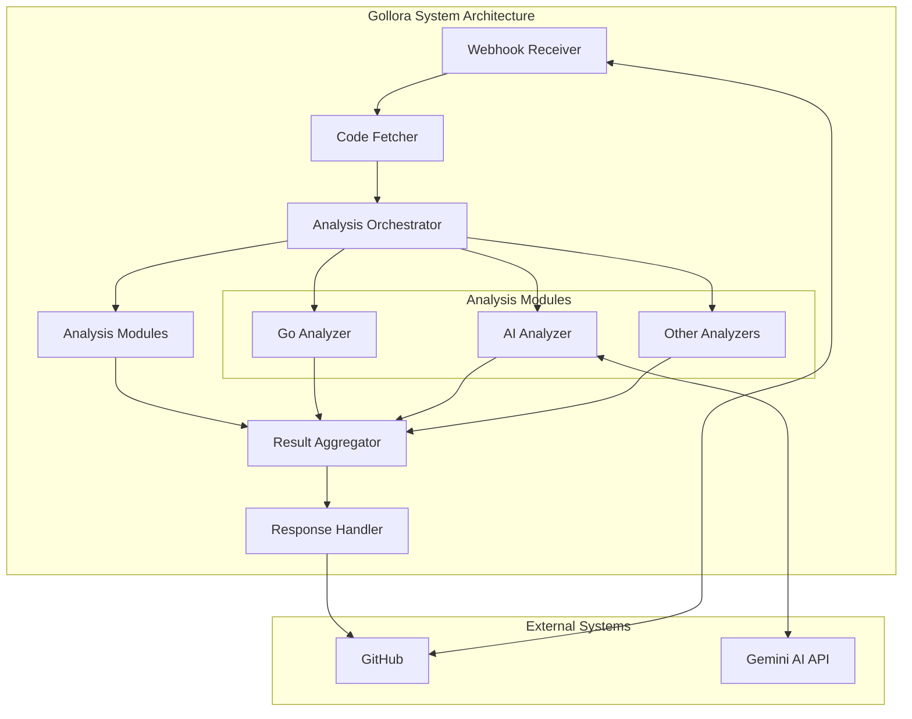

# Gollora Core Components

Gollora is a system that integrates with GitHub to provide code analysis and review services. The system is composed of several components that work together to analyze code changes and provide feedback to developers.

## Graphical Representation



### Gollora Architecture

```markdown
┌─────────────────────────────────────────────────────────────┐
│                     Gollora Architecture                    │
└─────────────────────────────────────────────────────────────┘
┌─────────────┐    ┌─────────────┐    ┌─────────────────────┐
│   Webhook   │    │    Code     │    │     Analysis        │
│  Receiver   │───▶│   Fetcher   │───▶│   Orchestrator      │
└─────────────┘    └─────────────┘    └─────────────────────┘
                                              │
                                              ▼
┌─────────────┐    ┌─────────────┐    ┌─────────────────────┐
│  Response   │    │   Result    │    │     Analysis        │
│  Handler    │◀───│ Aggregator  │◀───│     Modules         │
└─────────────┘    └─────────────┘    └─────────────────────┘

```

- **Webhook Receiver:**  
  - Accepts events from GitHub through a standardized webhook interface.

- **Code Fetcher:**  
  - Clones repositories and retrieves code changes.

- **Analysis Orchestrator:**  
  - Coordinates the execution of analysis tools.

- **Analysis Modules:**  
  - Language-specific analyzers.  
  - AI-powered analysis engine.

- **Result Aggregator:**  
  - Combines and deduplicates results.

- **Response Handler:**  
  - Formats and delivers comments back to GitHub.
