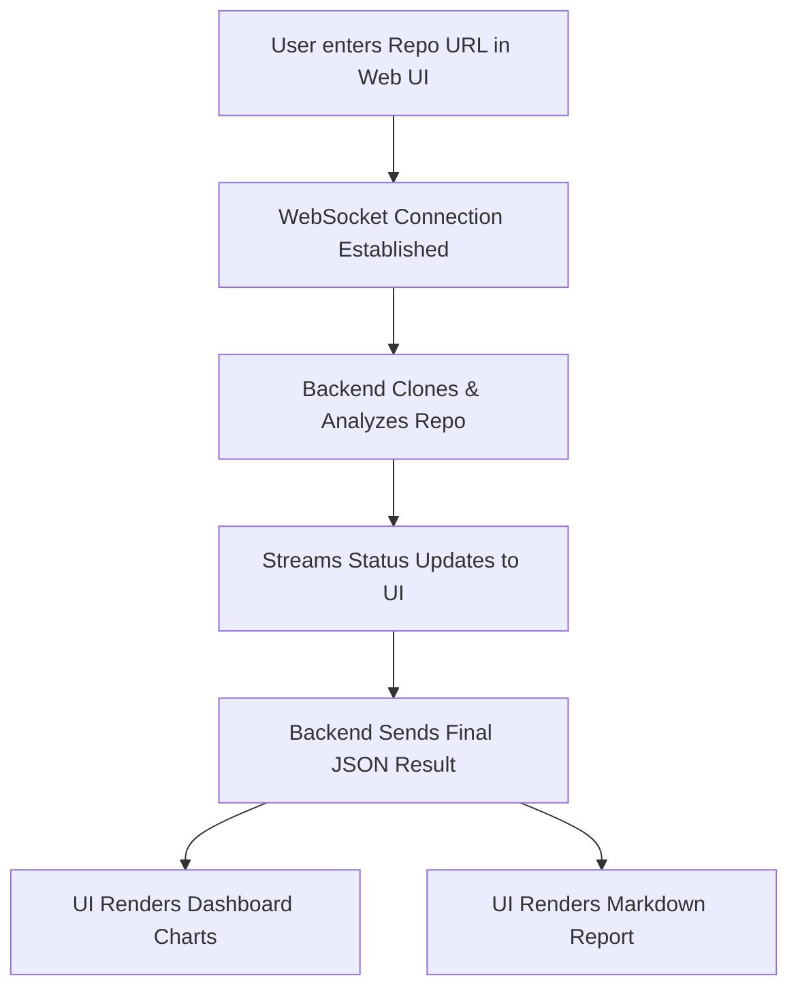

# Feature Deep Dive: On-Demand Analysis Dashboard

This feature provides a rich, interactive web interface for running analysis and visualizing the results, making code quality insights accessible to everyone.

### Presentation Flow

### What It Is
The On-Demand Analysis Dashboard is a single-page web application served at `/analyze` that allows any user to get a full quality report for a public GitHub repository just by entering its URL. It transforms the raw JSON analysis output into a set of easy-to-understand charts and a formatted report.

### How It Works
1.  **Initiation:** The user enters a repository URL into the input field in `web/analyze.html` and clicks "Analyze".
2.  **WebSocket Connection:** The frontend establishes a WebSocket connection to the `/analyze/ws` endpoint on the backend.
3.  **Backend Process:** The `handleAnalyzeWebsocket` function in `cmd/webhook.go` receives the URL, clones the repository, and runs the entire `ReviewEngine` analysis pipeline.
4.  **Live Logging:** Throughout this process, the backend sends status messages (e.g., "Cloning repository...", "Analyzing Go files...") over the WebSocket, which are displayed in the "Status Log" on the UI.
5.  **Result Transmission:** Once the analysis is complete, the backend sends the *entire* final `AnalysisResult` object as a single JSON string to the frontend.
6.  **Client-Side Rendering:** The JavaScript in `web/analyze.html` parses this JSON.
    - It uses the `summary` object to generate data for **Chart.js**, which then renders the pie, doughnut, and bar charts.
    - It uses the full result object to generate a complete Markdown report string, which is then parsed by **Marked.js** into HTML and displayed. The dependency graph is rendered by **Mermaid.js**.

### Use Cases & Examples

This UI makes the tool's power accessible without needing to use the command line.

#### Use Case 1: Quick Health Check on a Repository
A team lead wants to get a quick overview of a new microservice before a major release.

- **Action:** They navigate to `http://localhost:8080/analyze`, paste the repository URL, and click "Analyze".
- **Result:** Within moments, they see the dashboard. The "Issues by Severity" chart immediately shows a large red slice for "Critical" issues. The "File Hotspots" chart points to `pkg/auth/session.go` as the main problem area. They can then scroll down to the detailed report to see the specific hardcoded token issue that the AI flagged as critical, allowing them to address it before deployment.

#### Use Case 2: Visualizing Dependencies
A new developer joins a project and wants to understand the main dependencies.

- **Action:** They run an analysis on the repository.
- **Result:** They scroll to the "Dependency Graph" section of the report and can instantly see a visual diagram of the project's `go.mod` dependencies, helping them understand the software supply chain at a glance.