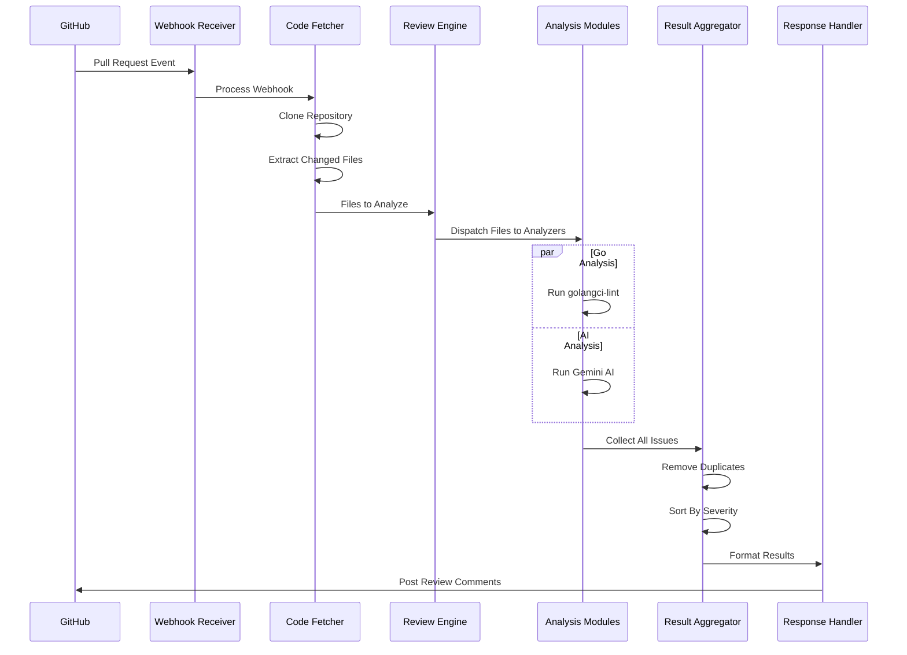

**Data Flow Diagram**
- A data flow diagram (DFD) is a graphical representation of the "flow" of data through an information system, modeling its process aspects.

## Graphical Representation of Data Flow



## Markdown Representation of Data Flow

```markdown
┌──────────┐                       ┌───────────┐
│  GitHub  │                       │  Gollora  │
│          │                       │  Server   │
└──────────┘                       └───────────┘
     │                                   │
     │ 1. Pull Request Created/Updated   │
     │ ───────────────────────────────▶ │
     │                                   │
     │                                   │ 2. Clone Repository
     │                                   │    & Fetch Changes
     │                                   │
     │                                   │ 3. Run Analysis Tools
     │                                   │    (Go Linters, AI)
     │                                   │
     │                                   │ 4. Aggregate Results
     │                                   │
     │ 5. Post Comments                  │
     │ ◀───────────────────────────────  │
     │-----------------------------------│

```

**Data Flow Steps**
1. GitHub triggers a webhook event when a pull request is created or updated.
2. Gollora server clones the repository and fetches the latest changes.
3. Analysis tools are executed on the codebase (e.g., Go linters, AI-powered engine).
4. Results from different analysis modules are aggregated and prioritized.
5. Comments are posted back to GitHub as feedback on the pull request.
