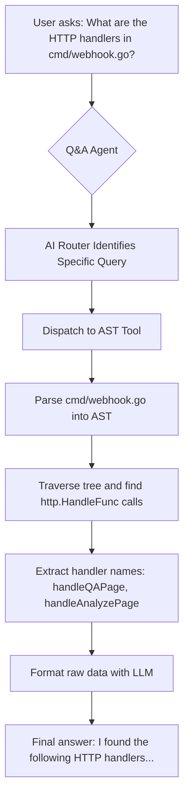

# Feature Deep Dive: AST-Powered Q&A

This feature provides the Q&A agent with a high-precision tool to answer specific questions about Go code structure, overcoming the limitations of pure language model reasoning.

### Presentation Flow

### What It Is
The AST (Abstract Syntax Tree) tool is a specialized module that the Q&A agent can use to analyze the source code of a Go file directly. Unlike a language model, which *reads* code as text, the AST tool *understands* its grammatical structure. This allows it to answer questions about functions, variables, and other code constructs with high precision.

### How It Works
1.  **Routing:** When a user asks a question, an AI-powered router in `internal/agent/agent.go` first determines the question's intent.
2.  **Dispatch:** If the router identifies a specific, structural query about a single Go file (e.g., find all X in file Y), it dispatches the request to the `ASTTool` in `internal/tools/ast_tool.go`.
3.  **Parsing:** The `ASTTool` uses Go's `go/parser` and `go/ast` packages to parse the target file into an Abstract Syntax Tree.
4.  **Traversal:** It programmatically walks the tree, inspecting relevant nodes (function declarations, call expressions, variable specs) to extract matching information.
5.  **Formatting:** The raw, structured data found (e.g., a list of function names) is passed to the LLM for friendly formatting before returning to the user.

### Use Cases & Examples

This tool is ideal for getting quick, factual answers about your Go codebase.

#### Use Case 1: Discovering API Endpoints
Quickly identify all the web server routes defined in a file.

- **Question:** `Show me all the HTTP handlers in cmd/webhook.go`
- **Expected Result:** The agent will respond with a clear list of the handlers it found, such as `handleQAPage`, `handleAnalyzeWebsocket`. This confirms the AI router correctly chose the `ast_tool` with the `find_http_handlers` query.

#### Use Case 2: Identifying Global State
Understand what global variables are defined in a package, which can be crucial for debugging state-related issues.

- **Question:** `What global variables are defined in cmd/main.go?`
- **Expected Result:** You will get a response listing the global flag variables like `configPath`, `serverMode`, `repoPath`. This confirms the `find_global_variables` query is working.
