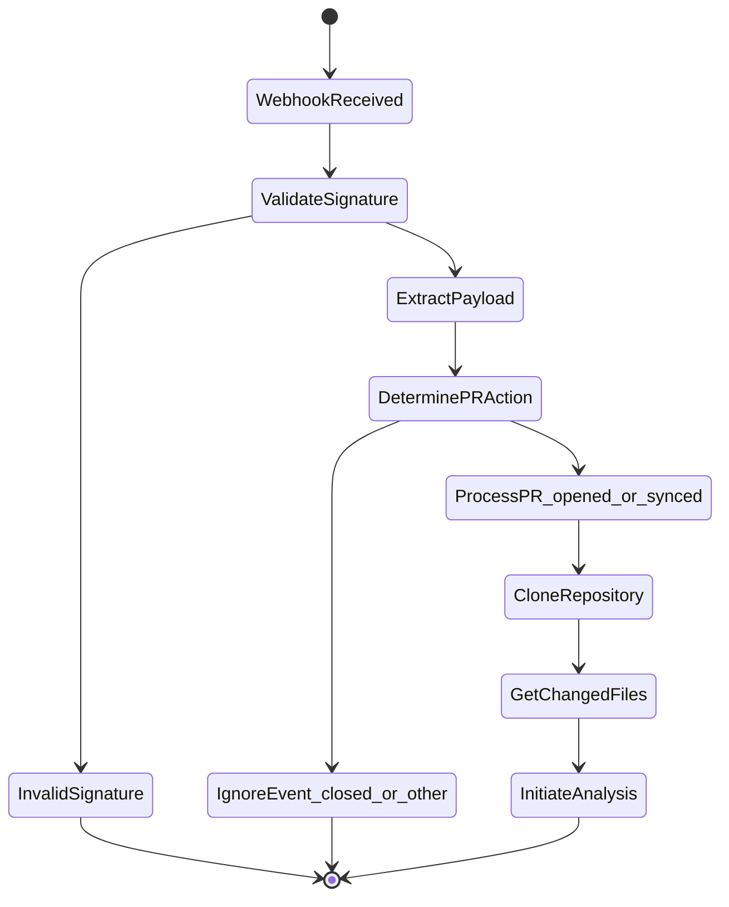
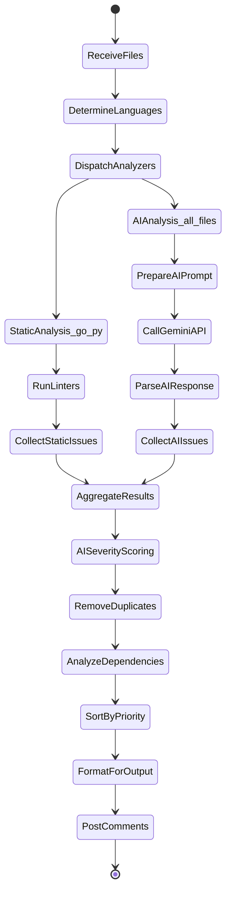
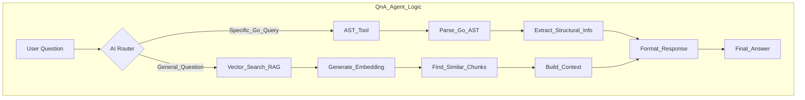
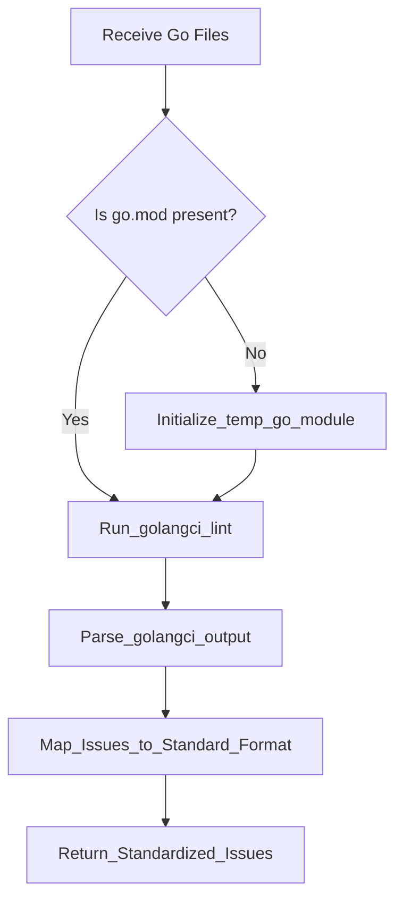
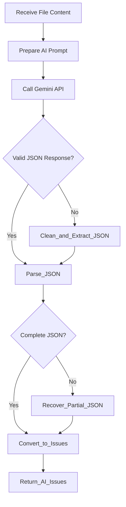

## Logical Flow of Files in Gollora

```mermaid 
flowchart TD
    subgraph Configuration
        A1[config.yaml]
        A2[analysis_tools.yaml]
        A3[Environment Variables]
    end
    
    subgraph Core_Components
        B[main.go]
        C[webhook.go]
        D[fetcher.go]
        E[review_engine.go]
        F[aggregator.go]
        G[response_handler.go]
    end
    
    subgraph Analysis_Agentic_Modules
        H[golang.go]
        I[ai_analyzer.go]
        P[agent.go]
        Q[ast_tool.go]
    end
    
    subgraph Models
        J[types.go]
        K[result.go]
    end
    
    subgraph External_Tools
        L[golangci-lint]
        M[staticcheck]
        N[gosec]
        O[Gemini API]
    end
    
    A1 --> B
    A2 --> B
    A3 --> B
    
    B --> C
    B --> E
    B --> P
    
    C --> D
    D --> E
    E --> H
    E --> I
    H --> F
    I --> F
    F --> G
    
    P --> Q
    P --> O
    
    H --> J
    H --> K
    I --> J
    I --> K
    
    H --> L
    H --> M
    H --> N
    I --> O
```

### Webhook Processing Flow

```mermaid
stateDiagram-v2
    [*] --> WebhookReceived
    WebhookReceived --> ValidateSignature
    ValidateSignature --> ExtractPayload
    ValidateSignature --> InvalidSignature
    InvalidSignature --> [*]
    ExtractPayload --> DeterminePRAction
    DeterminePRAction --> ProcessPR_opened_or_synced
    DeterminePRAction --> IgnoreEvent_closed_or_other
    IgnoreEvent_closed_or_other --> [*]
    ProcessPR_opened_or_synced --> CloneRepository
    CloneRepository --> GetChangedFiles
    GetChangedFiles --> InitiateAnalysis
    InitiateAnalysis --> [*]
```

### Analysis Flow

```mermaid
stateDiagram-v2
    [*] --> ReceiveFiles
    ReceiveFiles --> DetermineLanguages
    DetermineLanguages --> DispatchAnalyzers
    DispatchAnalyzers --> StaticAnalysis_go_py
    DispatchAnalyzers --> AIAnalysis_all_files
    StaticAnalysis_go_py --> RunLinters
    RunLinters --> CollectStaticIssues
    AIAnalysis_all_files --> PrepareAIPrompt
    PrepareAIPrompt --> CallGeminiAPI
    CallGeminiAPI --> ParseAIResponse
    ParseAIResponse --> CollectAIIssues
    CollectStaticIssues --> AggregateResults
    CollectAIIssues --> AggregateResults
    AggregateResults --> AISeverityScoring
    AISeverityScoring --> RemoveDuplicates
    RemoveDuplicates --> AnalyzeDependencies
    AnalyzeDependencies --> SortByPriority
    SortByPriority --> FormatForOutput
    FormatForOutput --> PostComments
    PostComments --> [*]
```

### Interactive Q&A Flow

```mermaid
flowchart TD
    subgraph QnA_Agent_Logic
        U[User Question] --> Router{AI Router}
        Router -- Specific_Go_Query --> AST_Tool
        Router -- General_Question --> Vector_Search_RAG
        AST_Tool --> Parse_Go_AST
        Parse_Go_AST --> Extract_Structural_Info
        Vector_Search_RAG --> Generate_Embedding
        Generate_Embedding --> Find_Similar_Chunks
        Find_Similar_Chunks --> Build_Context
        Extract_Structural_Info --> Format_Response
        Build_Context --> Format_Response
        Format_Response --> Final_Answer
    end
```

### Go Analysis Flow 

```mermaid
flowchart TD
    A[Receive Go Files] --> B{Is go.mod present?}
    B -->|Yes| Run_golangci_lint
    B -->|No| Initialize_temp_go_module
    Initialize_temp_go_module --> Run_golangci_lint
    Run_golangci_lint --> Parse_golangci_output
    Parse_golangci_output --> Map_Issues_to_Standard_Format
    Map_Issues_to_Standard_Format --> Return_Standardized_Issues
```

### AI Analysis Flow

```mermaid
flowchart TD
    A[Receive File Content] --> B[Prepare AI Prompt]
    B --> C[Call Gemini API]
    C --> D{Valid JSON Response?}
    D -->|Yes| Parse_JSON
    D -->|No| Clean_and_Extract_JSON
    Clean_and_Extract_JSON --> Parse_JSON
    Parse_JSON --> E{Complete JSON?}
    E -->|Yes| Convert_to_Issues
    E -->|No| Recover_Partial_JSON
    Recover_Partial_JSON --> Convert_to_Issues
    Convert_to_Issues --> Return_AI_Issues
```
