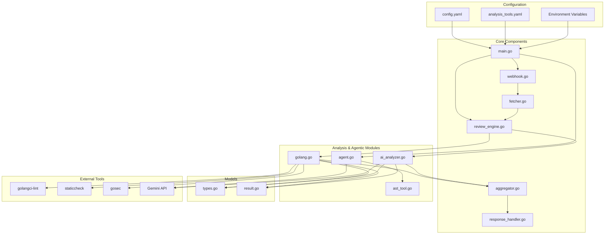
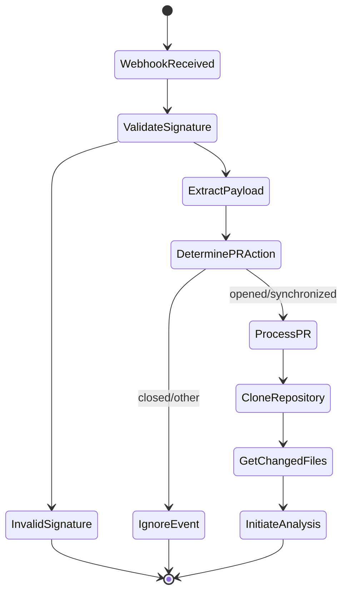
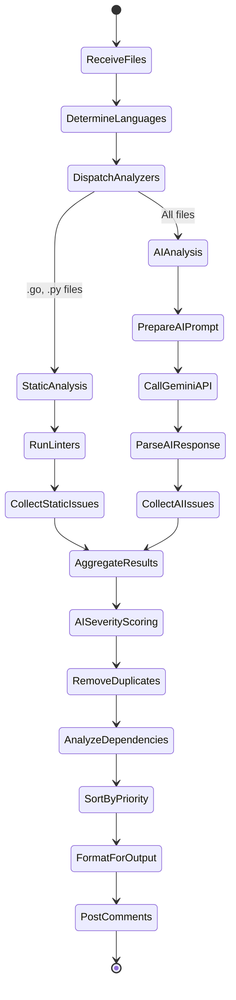
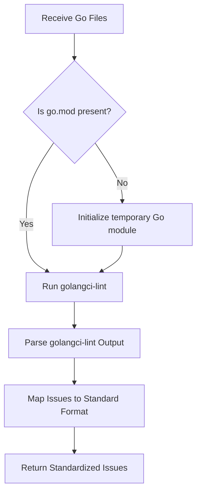
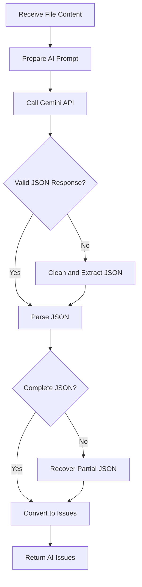

## Logical Flow of Files in Gollora



### Webhook Processing Flow



### Analysis Flow



### Interactive Q&A Flow

```mermaid
flowchart TD
    subgraph "Q&A Agent Logic"
        A[User Question] --> B{AI Router};
        B -- "Specific Go Query" --> C[AST Tool];
        B -- "General Question" --> D[Vector Search (RAG)];
        
        C --> E[Parse Go AST];
        E --> F[Extract Structural Info];
        
        D --> G[Generate Embedding];
        G --> H[Find Similar Chunks];
        H --> I[Build Context];
        
        F --> J{Format Response};
        I --> J;
        
        J --> K[Final Answer];
    end
```

### Go Analysis Flow 



### AI Analysis Flow


